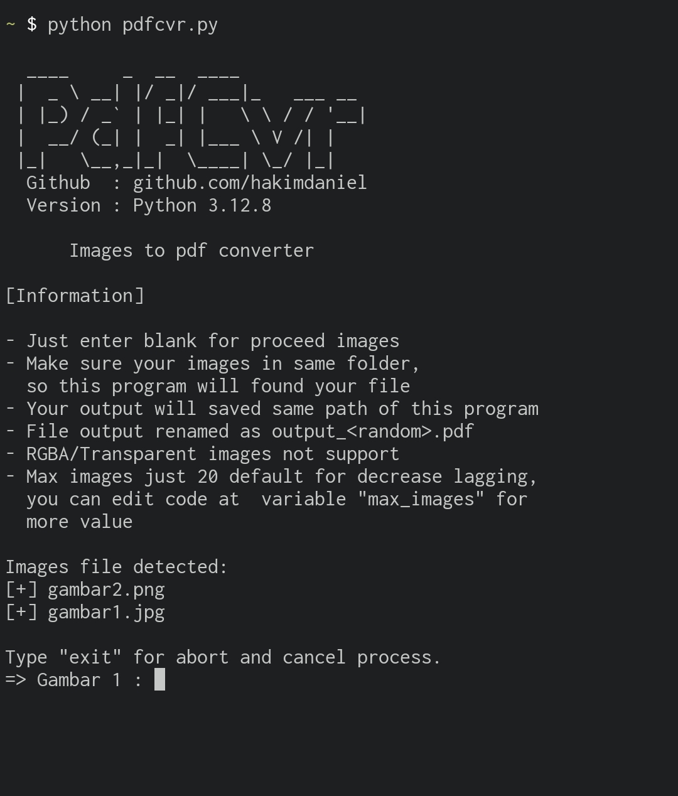

# img-to-pdf
Tool convert images into pdf file, easy to use. Created by python Coded by me.

# Download
download this "pdfcvr.py" file program.
download as zip in "code" button above and extract

If you're using command line
```shell
git clone https://github.com/hakimdaniel/img-to-pdf
cd img-to-pdf
ls
```

# Run Program

if you're using windows 7/10/11
just click the program to run as python program.

if you're using command line
```shell
python pdfcvr.py
```


Then enjoy the tool
