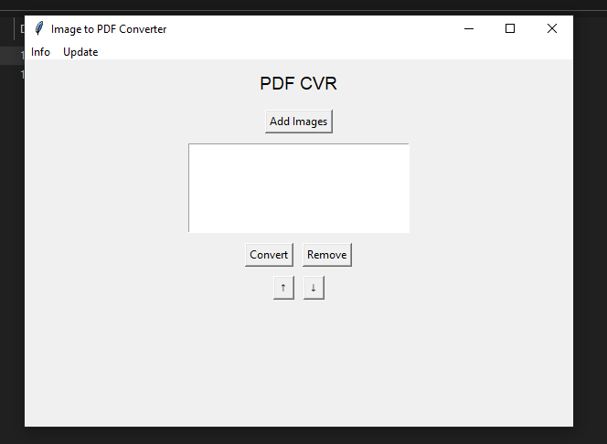
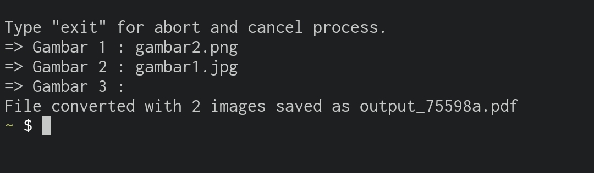
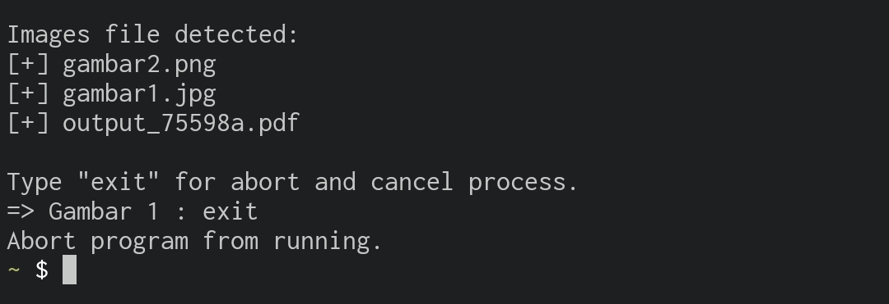

# img-to-pdf GUI Version (Recommended)
Tool convert images into pdf file, easy to use. Created by python Coded by me.
<a href="https://hakimdaniel.github.io/img-to-pdf/dist/pdf_cvr.exe">Download UI Version Here</a>

Simply run after download tool. This tool is not licensed by any community so, this just my personal project tool. So, to run this tool, double click at "pdf_cvr.exe" then goto "more info" and run anyway, windows just doesn't trust this tool because you never download it before then it's not from big community, just my unlicensed personal project.

Give star ⭐ to my project in github 😁

# Now available in User Interface
- dist/pdf_cvr.exe
<br>



# Requirement for CLI Version (Optional)
- make sure you have python installed into your pc/laptop https://python.org/downloads
- Usaha tawakkal

# Download
download this "pdfcvr.py" file program.
download as zip in "code" button above and extract

If you're using command line
```shell
git clone https://github.com/hakimdaniel/img-to-pdf
cd img-to-pdf
ls
```

# Run Program

if you're using windows 7/10/11
just click the program to run as python program after file downloaded.

if you're using command line
```shell
python pdfcvr.py
```





Then enjoy the tool
